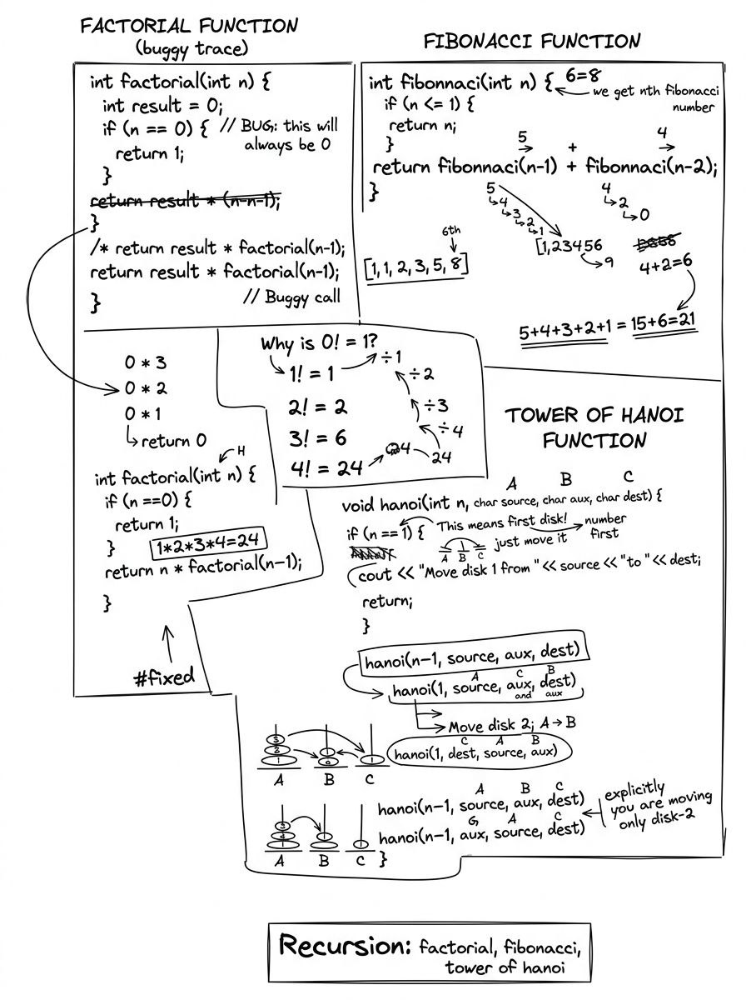
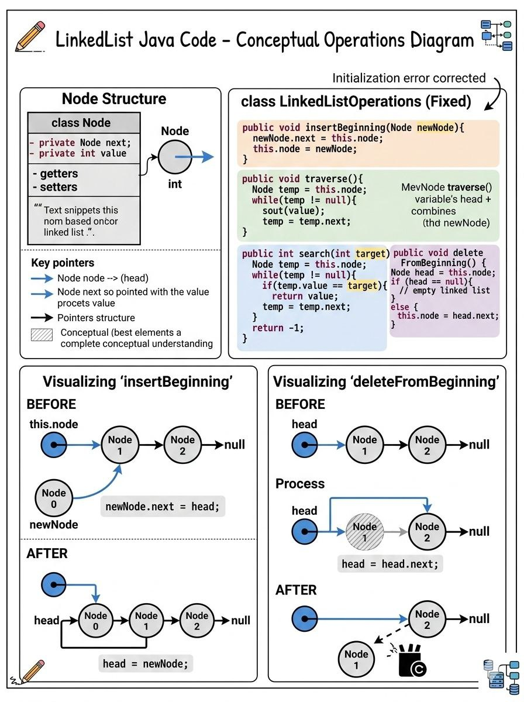
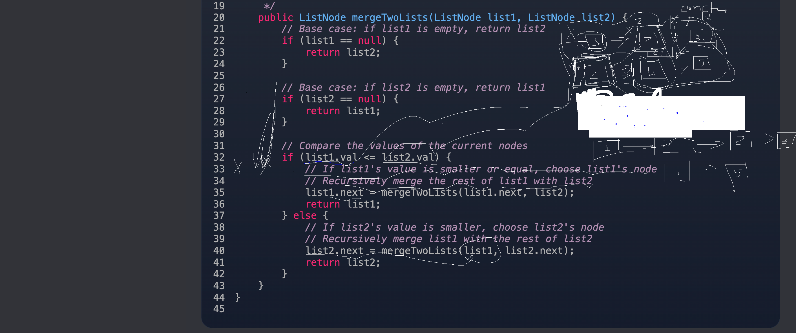

# data-structure

> My notes in code form — from **DSA Course 1**.

The course runs in **C++**, but some problems were too fun not to rewrite in **Java** too.
Every solution lives in its own folder, is cleaned up, and **compiles & runs on its own**.


---

## Repository structure

```
.
├── cpp/
│   ├── recursion/            factorial, Fibonacci, Tower of Hanoi, array ops
│   │   ├── recursion.cpp
│   │   └── explanation.jpg
│   ├── move-zero-to-end/     move all zeros to the end, in place
│   │   └── move-zero-to-end.cpp
│   ├── linked-list/          singly linked list: traverse, search, insert
│   │   ├── LinkedList.cpp
│   │   └── explanation.jpg
│   ├── music-playlist/       a playlist modeled as a linked list
│   │   └── MusicLinkedList.cpp
│   ├── stack-array/          stack backed by an array
│   │   └── stack_array.cpp
│   ├── stack-linked-list/    stack backed by a linked list
│   │   └── stack_linked_list.cpp
│   └── queue/                queue backed by an array
│       └── queue.cpp
└── java/
    ├── music-playlist/                the playlist, ported to Java
    │   ├── Main.java
    │   ├── Node.java
    │   └── PlayList.java
    ├── find-middle-of-linked-list/    tortoise-and-hare middle finder
    │   ├── FindMiddleOfLinkedList.java
    │   └── Node.java
    ├── merge-two-sorted-linked-list/  recursively merge two sorted lists
    │   ├── MergeTwoSortedLinkedList.java
    │   ├── ListNode.java
    │   └── explanation.png
    ├── palindrome-linked-list/        check a list reads the same both ways
    │   ├── PalindromeLinkedList.java
    │   └── ListNode.java
    ├── intersection-of-two-linked-lists/  two-pointer intersection finder
    │   ├── Solution.java
    │   ├── ListNode.java
    │   └── intersection_of_two_linked_lists_two_pointer_visualizer.html
    ├── contains-duplicate/             detect a repeated value with a hash set
    │   └── ContainsDuplicate.java
    ├── two-sum/                        find the pair that sums to a target with a hash map
    │   ├── TwoSum.java
    │   └── two_sum_hashmap_walkthrough.html
    ├── keyboard-row/                   words typable with a single keyboard row
    │   ├── KeyboardRow.java
    │   └── keyboard_row_step_debugger.html
    ├── ransom-note/                    build a note from magazine letters with a hash map
    │   ├── Solution.java
    │   └── ransom_note_step_debugger.html
    ├── valid-anagram/                  check two strings are anagrams — two ways
    │   ├── Solution.java
    │   ├── SolutionSorting.java
    │   └── valid_anagram_step_debugger.html
    └── group-anagrams/                 cluster anagrams together with a sorted-key hash map
        ├── Solution.java
        └── group_anagrams_step_debugger.html
```

---

## Getting started

You only need a **C++17 compiler** (`g++` or `clang++`) and a **JDK** (for the Java solution).

**Run any C++ solution:**

```bash
cd cpp/<folder>
g++ -std=c++17 -o solution.out *.cpp && ./solution.out
```

**Run the Java solution:**

```bash
cd java/music-playlist
javac *.java && java Main
```

> Compiled binaries, `*.out`, and `*.class` files are git-ignored, so building in place keeps the repo clean.

---

## Overview

| # | Topic | Language | Folder |
|---|---|---|---|
| 1 | Recursion — factorial, Fibonacci, Tower of Hanoi, array reverse & insert | C++ | [`cpp/recursion`](cpp/recursion) |
| 2 | Move all zeros to the end, in place | C++ | [`cpp/move-zero-to-end`](cpp/move-zero-to-end) |
| 3 | Singly linked list — traverse, search, insert | C++ | [`cpp/linked-list`](cpp/linked-list) |
| 4 | Music playlist — linked list | C++ | [`cpp/music-playlist`](cpp/music-playlist) |
| 5 | Stack — array-backed | C++ | [`cpp/stack-array`](cpp/stack-array) |
| 6 | Stack — linked list | C++ | [`cpp/stack-linked-list`](cpp/stack-linked-list) |
| 7 | Queue — array-backed | C++ | [`cpp/queue`](cpp/queue) |
| 8 | Music playlist — linked list | Java | [`java/music-playlist`](java/music-playlist) |
| 9 | Find the middle of a linked list | Java | [`java/find-middle-of-linked-list`](java/find-middle-of-linked-list) |
| 10 | Merge two sorted linked lists | Java | [`java/merge-two-sorted-linked-list`](java/merge-two-sorted-linked-list) |
| 11 | Palindrome linked list | Java | [`java/palindrome-linked-list`](java/palindrome-linked-list) |
| 12 | Intersection of two linked lists — two pointers | Java | [`java/intersection-of-two-linked-lists`](java/intersection-of-two-linked-lists) |
| 13 | Contains duplicate — hash set | Java | [`java/contains-duplicate`](java/contains-duplicate) |
| 14 | Two sum — hash map | Java | [`java/two-sum`](java/two-sum) |
| 15 | Keyboard row — words typable with a single keyboard row | Java | [`java/keyboard-row`](java/keyboard-row) |
| 16 | Ransom note — build a note from magazine letters with a hash map | Java | [`java/ransom-note`](java/ransom-note) |
| 17 | Valid anagram — hash-map tally & sorting | Java | [`java/valid-anagram`](java/valid-anagram) |
| 18 | Group anagrams — sorted-key hash map | Java | [`java/group-anagrams`](java/group-anagrams) |

---

## C++ solutions

### 1. Recursion · [`cpp/recursion`](cpp/recursion)

Four canonical recursive routines plus one iterative array example for contrast.

- **What it does:** `factorial`, `fibonacci`, Tower of Hanoi (`hanoi`), in-place `reverseArray`, and an iterative insert-by-shifting demo.
- **How it works:** each recursive function calls itself on a smaller subproblem until it hits a base case, then the results unwind back up the call stack. `factorial(n)` stops at `n == 0`; `fibonacci(n)` stops at `n <= 1`; `hanoi(n, …)` moves the top `n-1` disks aside, moves disk `n`, then moves the `n-1` disks back; `reverseArray` swaps the outer pair and recurses inward.
- **Complexity:** factorial `O(n)`, Fibonacci `O(2ⁿ)` (naive), Tower of Hanoi `O(2ⁿ)` moves, reverse `O(n)`. Stack depth `O(n)`.

```bash
cd cpp/recursion
g++ -std=c++17 -o recursion.out recursion.cpp && ./recursion.out
```

```text
Factorial of 4: 24

Fibonacci of 6: 8

Tower of Hanoi moves for 3 disks:
Move disk 1 from A to C
Move disk 2 from A to B
Move disk 1 from C to B
Move disk 3 from A to C
Move disk 1 from B to A
Move disk 2 from B to C
Move disk 1 from A to C

Array insertion, adding '7' at index 1: 1 7 2 3 4
Reversed array: 5 4 3 2 1
```

**Hand-drawn explanation:**



---

### 2. Move Zeros to End · [`cpp/move-zero-to-end`](cpp/move-zero-to-end)

A classic two-pointer / stable-partition problem.

- **What it does:** moves every `0` to the end of the array while keeping the order of the non-zero elements, in place.
- **How it works:** a write pointer `nonZeroIndex` marks the next slot for a non-zero value. A single pass swaps each non-zero element forward, so non-zeros stay in order and zeros are pushed to the back.
- **Complexity:** time `O(n)`, space `O(1)`.

```bash
cd cpp/move-zero-to-end
g++ -std=c++17 -o move.out move-zero-to-end.cpp && ./move.out
```

```text
original array: 1 0 2 0 5 0 15
after nonzero method array: 1 2 5 15 0 0 0
```

---

### 3. Singly Linked List · [`cpp/linked-list`](cpp/linked-list)

A list built from `Node { int data; Node* next; }`, accessed through a head pointer.

- **What it does:** `traverse`, `search`, and insert at the **beginning**, **end**, and an **arbitrary position**.
- **How it works:** `insertBegin` links a new node in front of `head` and updates `head` (passed by reference so the change persists). `insertEnd` walks to the last node and links there. `insertAtPosition` advances to the `(pos-1)`th node and splices the new node in, guarding against an out-of-range position.
- **Complexity:** traverse/search `O(n)`, insert-begin `O(1)`, insert-end / insert-at-position `O(n)`.

```bash
cd cpp/linked-list
g++ -std=c++17 -o linkedlist.out LinkedList.cpp && ./linkedlist.out
```

```text
Initial list: 1 2 3
search(2) -> found
After insertEnd(5): 1 2 3 5
After insertBegin(4): 4 1 2 3 5
After insertAtPosition(3, 2): 4 3 1 2 3 5
```

**Hand-drawn explanation:**



---

### 4. Music Playlist (C++) · [`cpp/music-playlist`](cpp/music-playlist)

A singly linked list where each node is a song (name, artist, duration). This is the C++ twin of the Java solution below.

- **What it does:** `insertNewSong` (front insert), `deleteSongByName`, `searchSongByName`, `playNextSong`, `countTotalNum`, and `displayPlaylist`.
- **How it works:** the `Playlist` wraps a single `head` pointer; front insertion is `O(1)`, while delete/search/count walk the chain. `deleteSongByName` handles the empty-list and head-match cases, then relinks `prev->next` around the matched node.
- **Complexity:** insert `O(1)`; delete / search / count / display `O(n)`.

```bash
cd cpp/music-playlist
g++ -std=c++17 -o playlist.out MusicLinkedList.cpp && ./playlist.out
```

```text
Song name D / artist DD / duration 1
Song name Z / artist ZZ / duration 1
Song name X / artist XX / duration 1

Deleted song name Y
Displaying next song of : D  ->  Z (ZZ, 1)
Song was found: X (XX, 1)
Total musics in playlist: 3
```

---

### 5. Stack — Array-backed · [`cpp/stack-array`](cpp/stack-array)

A fixed-capacity **LIFO** stack over a dynamically allocated array.

- **What it does:** `push`, `pop`, `peek`, `isEmpty`, with overflow and underflow guards.
- **How it works:** a `top` index (starting at `-1`) tracks the current top. `push` rejects a full stack; `pop`/`peek` return `-1` on an empty stack instead of reading out of bounds.
- **Complexity:** `O(1)` per operation; `O(n)` space for the backing array.

```bash
cd cpp/stack-array
g++ -std=c++17 -o stack.out stack_array.cpp && ./stack.out
```

```text
Peek: 30
Pop: 30
Pop: 20
Peek: 10
Is Empty: 0
Is Empty: 1
Stack Underflow
Stack Overflow
```

---

### 6. Stack — Linked List · [`cpp/stack-linked-list`](cpp/stack-linked-list)

The same **LIFO** stack, but dynamically sized using a linked list — no fixed capacity.

- **What it does:** `push`, `pop`, `peek`, `isEmpty`.
- **How it works:** a single `top` pointer references the head node. `push` links a new node in front of `top`; `pop` unlinks the top node, frees it with `delete`, and returns its value.
- **Complexity:** `O(1)` per operation; `O(n)` space for `n` nodes.

```bash
cd cpp/stack-linked-list
g++ -std=c++17 -o stack.out stack_linked_list.cpp && ./stack.out
```

```text
Peek: 30
Pop: 30
Pop: 20
Peek: 10
Is Empty: 0
Is Empty: 1
Stack Underflow
```

---

### 7. Queue — Array-backed · [`cpp/queue`](cpp/queue)

A fixed-capacity **FIFO** queue over an array, using a simple count-based strategy.

- **What it does:** `enqueue`, `dequeue`, `getFront`, `getRear`, `isEmpty`, `isFull`.
- **How it works:** a single `count` tracks the live elements — the front is always index `0` and the rear is `count-1`. `enqueue` appends at `arr[count]`; `dequeue` shifts every element one slot toward the front.
- **Complexity:** `enqueue` / `getFront` / `getRear` `O(1)`; `dequeue` `O(n)` because of the shift.

```bash
cd cpp/queue
g++ -std=c++17 -o queue.out queue.cpp && ./queue.out
```

```text
front: 10
rear: 30
rear dequeue front: 20
Queue Overflow
```

---

## Java solutions

### 8. Music Playlist (Java) · [`java/music-playlist`](java/music-playlist)

The same playlist as solution 4, written in Java across three files: `Node`, `PlayList`, and a `Main` driver.

- **What it does:** `insertNewSong`, `deleteSongByName`, `searchSongByName`, `playNextSong`, `countTotalNum`, `displayPlaylist`.
- **How it works:** `Node` stores a song and a `next` reference; `PlayList` keeps the head. Insertion prepends in `O(1)`; deletion walks with `curr`/`prev` pointers and relinks around the matched node (using `Objects.equals` for name comparison).
- **Complexity:** insert `O(1)`; search / delete / count `O(n)`.

```bash
cd java/music-playlist
javac *.java && java Main
```

```text
Song name D / artist DD / duration 1
Song name Z / artist ZZ / duration 1
Song name X / artist XX / duration 1

Deleted song name Y
Displaying next song of : D  ->  Z (ZZ, 1)
Song was found: X (XX, 1)
Total musics in playlist: 3
```

---

### 9. Find the Middle of a Linked List · [`java/find-middle-of-linked-list`](java/find-middle-of-linked-list)

Returns the middle node of a singly linked list in a single pass.

- **What it does:** finds the middle element without first counting the length.
- **How it works:** the **tortoise-and-hare** two-pointer technique — `fast` advances two nodes per step, `slow` one. When `fast` reaches the end, `slow` is at the middle. (For an even-length list it returns the second of the two middle nodes.) Ships with its own minimal `Node`.
- **Complexity:** time `O(n)`, space `O(1)`.

```bash
cd java/find-middle-of-linked-list
javac *.java && java FindMiddleOfLinkedList
```

```text
middle: 3
```

---

### 10. Merge Two Sorted Linked Lists · [`java/merge-two-sorted-linked-list`](java/merge-two-sorted-linked-list)

Merges two already-sorted linked lists into one sorted list.

- **What it does:** combines `1→3→5` and `2→4→6` into `1→2→3→4→5→6`.
- **How it works:** recursion — compare the two heads, take the smaller node, and link it to the merge of the remaining nodes. The base case is when one list is empty. Ships with its own minimal `ListNode`.
- **Complexity:** time `O(n + m)`, recursion depth `O(n + m)`.

```bash
cd java/merge-two-sorted-linked-list
javac *.java && java MergeTwoSortedLinkedList
```

```text
merged: 1 2 3 4 5 6
```

**Hand-drawn explanation:**



---

### 11. Palindrome Linked List · [`java/palindrome-linked-list`](java/palindrome-linked-list)

Checks whether a linked list reads the same forwards and backwards.

- **What it does:** returns `true` if the list is a palindrome, `false` otherwise.
- **How it works:** find the middle with tortoise-and-hare, reverse the second half in place, then walk the second half against the first half comparing values. Ships with its own minimal `ListNode`.
- **Complexity:** time `O(n)`, space `O(1)`.

```bash
cd java/palindrome-linked-list
javac *.java && java PalindromeLinkedList
```

```text
result: false
```

---

### 12. Contains Duplicate · [`java/contains-duplicate`](java/contains-duplicate)

Checks whether an array holds any value more than once.

- **What it does:** returns `true` if any value appears at least twice, `false` if every value is distinct.
- **How it works:** walk the array once, adding each value to a `HashSet`. `add` returns `false` when the value is already present, so the first failed add means a duplicate was found.
- **Complexity:** time `O(n)`, space `O(n)`.

```bash
cd java/contains-duplicate
javac *.java && java ContainsDuplicate
```

```text
has duplicate: true
has duplicate: false
```

### 13. Two Sum · [`java/two-sum`](java/two-sum)

Finds the indices of the two numbers in an array that add up to a target.

- **What it does:** returns the pair of indices `[i, j]` such that `nums[i] + nums[j] == target`.
- **How it works:** one pass with a `HashMap<value, index>`. For each element, look up its complement (`target - nums[i]`); if it was already stored, return both indices, otherwise record the current value so a later element can pair with it. Checking before storing keeps an element from matching itself.
- **Complexity:** time `O(n)`, space `O(n)`.
- **Walkthrough:** open [`two_sum_hashmap_walkthrough.html`](java/two-sum/two_sum_hashmap_walkthrough.html) for a step-by-step, line-by-line visualization of the map filling up until the complement clicks.

```bash
cd java/two-sum
javac *.java && java TwoSum
```

```text
[0, 1]
[1, 2]
[0, 1]
```

---

### 14. Keyboard Row · [`java/keyboard-row`](java/keyboard-row)

Finds which words can be typed using letters from **one row** of an American keyboard (LeetCode 500).

- **What it does:** returns the subset of the input words whose letters all sit on the same keyboard row (`qwertyuiop`, `asdfghjkl`, or `zxcvbnm`).
- **How it works:** a 26-character lookup string `rows` maps each letter to its row via `rows.charAt(c - 'a')`. For each word, read the row of the first letter as the `target`, then scan the rest — the moment a letter maps to a different row the word is disqualified and the inner loop breaks. Case is normalized with `toLowerCase()` first so the char arithmetic stays in `a`–`z`.
- **Complexity:** time `O(n · k)` for `n` words of average length `k`, space `O(1)` beyond the output.
- **Walkthrough:** open [`keyboard_row_step_debugger.html`](java/keyboard-row/keyboard_row_step_debugger.html) for a step-by-step debugger — watch `rows.charAt(c - 'a')` run one letter at a time, with a live keyboard, the char arithmetic, and the row-mapping strip. Type your own words to test.

```bash
cd java/keyboard-row
javac *.java && java KeyboardRow
```

```text
[Alaska, Dad]
[]
[adsdf, sfd]
```

---

### 15. Ransom Note · [`java/ransom-note`](java/ransom-note)

Decides whether a **ransom note** can be built using only the letters found in a **magazine**, each magazine letter used at most once (LeetCode 383).

- **What it does:** returns `true` if every character of `ransomNote` can be covered by the characters in `magazine`, otherwise `false`.
- **How it works:** a two-pass tally. The first loop walks the magazine and counts each character into a `HashMap<Character, Integer>` — the inventory of available letters. The second loop walks the ransom note and spends from that inventory: if a needed letter has `0` remaining it returns `false` immediately, otherwise it decrements the count. Surviving the whole note means every character was covered, so it returns `true`.
- **Complexity:** time `O(m + n)` for magazine length `m` and note length `n`, space `O(k)` for the `k` distinct characters counted.
- **Walkthrough:** open [`ransom_note_step_debugger.html`](java/ransom-note/ransom_note_step_debugger.html) for a step-by-step debugger — watch the map fill during the magazine pass, then drain during the ransom-note pass, with every step mapped to a highlighted line of code. Type your own inputs to test.

```bash
cd java/ransom-note
javac *.java && java Solution
```

```text
false
false
true
true
```

---

### 17. Valid Anagram · [`java/valid-anagram`](java/valid-anagram)

Decides whether **t** is an anagram of **s** — the same letters, each used the same number of times, just reordered (LeetCode 242). Two independent takes on the same problem.

- **What it does:** returns `true` when `s` and `t` contain exactly the same multiset of characters, otherwise `false`.
- **How it works (hash-map tally, [`Solution.java`](java/valid-anagram/Solution.java)):** if the lengths differ it returns `false` up front. Otherwise a two-pass tally — the first loop counts each character of `s` into a `HashMap<Character, Integer>`, and the second loop spends those counts against `t`: a needed letter at `0` remaining means the multisets differ, so it returns `false`; surviving the whole of `t` returns `true`.
- **How it works (sorting, [`SolutionSorting.java`](java/valid-anagram/SolutionSorting.java)):** splay both strings into `char[]`, `Arrays.sort` each, and `Arrays.equals` them. Anagrams collapse to the same sorted sequence; differing lengths are never equal, so no explicit length guard is needed.
- **Complexity:** tally is time `O(n)`, space `O(k)` for the `k` distinct characters; sorting is time `O(n log n)`, space `O(n)` for the char arrays but no auxiliary map.
- **Walkthrough:** open [`valid_anagram_step_debugger.html`](java/valid-anagram/valid_anagram_step_debugger.html) for a step-by-step debugger of the hash-map version — guard the lengths, fill the map while counting `s`, then drain it while consuming `t`, with every step mapped to a highlighted line of code. Type your own inputs to test.

```bash
cd java/valid-anagram
javac *.java && java Solution && java SolutionSorting
```

```text
true
false
false
true
true
false
false
true
```

---

### 18. Group Anagrams · [`java/group-anagrams`](java/group-anagrams)

Clusters an array of strings so that words which are anagrams of each other end up in the same group (LeetCode 49).

- **What it does:** given `["eat", "tea", "tan", "ate", "nat", "bat"]`, returns `[[eat, tea, ate], [tan, nat], [bat]]` — one list per set of anagrams, in any order.
- **How it works:** the trick is a **canonical key** that every anagram shares. Sorting a word's characters collapses all of its anagrams to the same sorted string (`eat`, `tea`, `ate` all become `aet`). Walk the words once, and for each one sort its characters into that key, then `computeIfAbsent` files the original word under the key — creating the bucket the first time a key is seen and reusing it after. The map's values are the finished groups.
- **Complexity:** time `O(n · k log k)` for `n` words of average length `k` (the per-word sort dominates), space `O(n · k)` for the map.
- **Walkthrough:** open [`group_anagrams_step_debugger.html`](java/group-anagrams/group_anagrams_step_debugger.html) for a step-by-step debugger — watch each word get sorted into its key and dropped into a bucket, with buckets forming and filling as anagrams collide on the same key, every step mapped to a highlighted line of code. Type your own words to test.

```bash
cd java/group-anagrams
javac *.java && java Solution
```

```text
[[eat, tea, ate], [bat], [tan, nat]]
[[]]
[[a]]
```

---

## License

[MIT](LICENSE)
